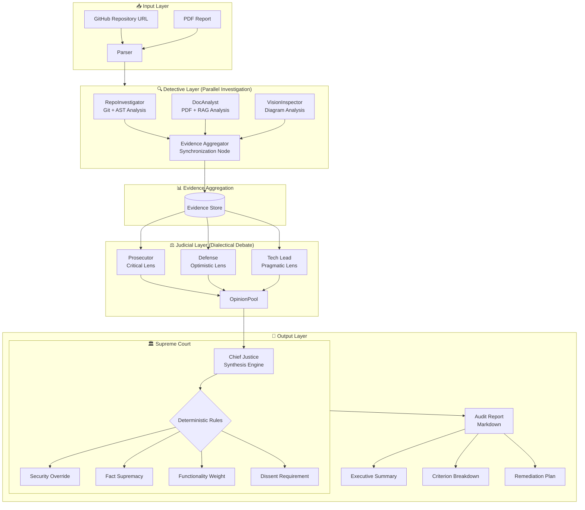
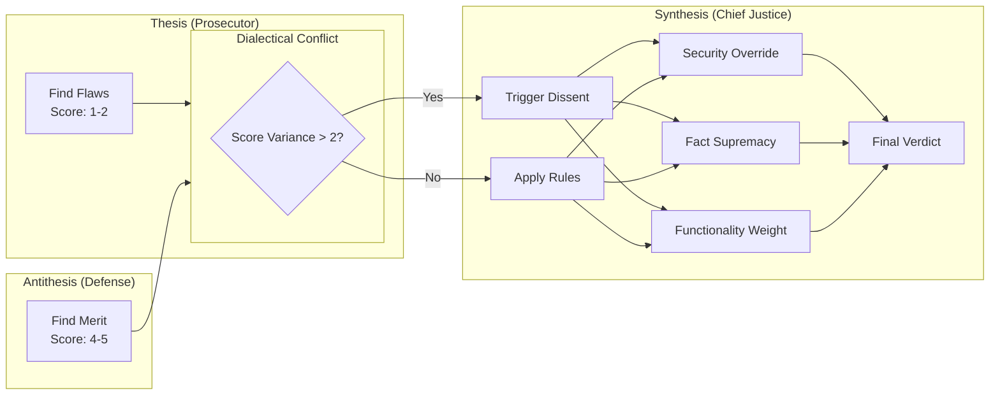

# 🤖 Automaton Auditor
A multi-agent LangGraph swarm for autonomous code audit and governance. Digital courtroom architecture with parallel detectives and dialectical judges.

<div align="center">
  
  
  
  
  
  **A Multi-Agent System for Autonomous Code Audit & Governance**
  
  *"Digital Courtroom Architecture with Parallel Detectives and Dialectical Judges"*
  
</div>

---

## 📋 Overview

The Automaton Auditor is a production-grade **multi-agent system** built with LangGraph that autonomously audits GitHub repositories against complex rubrics. It implements a hierarchical "digital courtroom" architecture where specialized agents collaborate to produce forensic-grade audit reports.

This system addresses the scaling challenge in AI-Native Enterprises: **when 1000 agents generate code simultaneously, humans cannot manually review every PR**. The Automaton Auditor provides automated quality assurance at scale.

---
## 🏛️ Architecture: The Digital Courtroom



### 🔄 Parallel Execution Flow

The architecture implements **two layers of parallel processing**:

| Layer | Components | Pattern |
|-------|------------|---------|
| **Detective Layer** | RepoInvestigator, DocAnalyst, VisionInspector | Fan-out → Aggregate |
| **Judicial Layer** | Prosecutor, Defense, TechLead | Fan-out → Synthesize |

### ⚖️ Dialectical Synthesis 



---

## 🎯 Key Features

### 🔍 Forensic Detective Layer
- **RepoInvestigator**: AST-based code analysis (not regex) with git history forensics
- **DocAnalyst**: PDF parsing with RAG-lite architecture for targeted queries
- **VisionInspector**: Multimodal diagram analysis (optional but implemented)

### ⚖️ Dialectical Judicial Layer
- **Prosecutor**: Adversarial lens - finds flaws, gaps, and security issues
- **Defense**: Optimistic lens - rewards effort and creative solutions  
- **Tech Lead**: Pragmatic lens - evaluates maintainability and viability

### 🏛️ Supreme Court Synthesis
- **Deterministic conflict resolution** (not LLM averaging)
- **Security override rules** - vulnerabilities cap scores
- **Fact supremacy** - evidence overrides opinion
- **Dissent requirement** - explains score variance

### 🛡️ Production-Grade Infrastructure
- **Pydantic validation** throughout
- **State reducers** (`operator.add`, `operator.ior`) for parallel safety
- **Sandboxed execution** with tempfile isolation
- **LangSmith observability** for full traceability
- **uv package management** for dependency isolation

---
# 📂 Project Structure
```bash
automaton-auditor/
├── src/
│   ├── __init__.py
│   ├── state.py                 # Pydantic models with reducers
│   ├── graph.py                  # LangGraph state machine
│   ├── nodes/
│   │   ├── detectives.py         # Forensic collectors
│   │   ├── judges.py              # Three judicial personas
│   │   └── justice.py             # Chief Justice synthesis
│   └── tools/
│       ├── repo_tools.py          # Git + AST analysis
│       └── doc_tools.py           # PDF parsing + RAG
├── tests/
│   ├── test_detectives.py
│   ├── test_judges.py
│   └── test_synthesis.py
├── audits/
│   ├── report_onself_generated/   #  my agent vs my repo
│   ├── report_onpeer_generated/    # my agent vs peer repo
│   └── report_bypeer_received/     # Peer agent vs my repo
├── .env.example                    # API key template
├── pyproject.toml                  # uv dependencies
├── README.md                       # This file
└── Dockerfile                      # Optional container
```

# 🚀 Automaton Auditor 

##  Completed Features

### State Management
-  Pydantic models with `operator.add`/`operator.ior` reducers
-  Evidence, JudicialOpinion, AuditReport schemas
-  Type-safe parallel execution

### Forensic Tools
-  Sandboxed git clone with `tempfile`
-  AST parsing for graph structure detection
-  Git history analysis for commit progression
-  PDF text extraction and chunking
-  RAG-lite with ChromaDB for targeted queries

### Detective Layer
-  RepoInvestigator node (parallel)
-  DocAnalyst node (parallel)
-  EvidenceAggregator for synchronization

### Graph Architecture
-  Fan-out: START → [Repo, Doc]
-  Fan-in: [Repo, Doc] → Aggregator
-  State reducers prevent overwrites
## 🚀 Quick Start

### Prerequisites
```bash
# Install uv (fast Python package manager)
curl -LsSf https://astral.sh/uv/install.sh | sh

# Python 3.10+
python --version
```
# Installation
```bash
# Clone repository
git clone https://github.com/TsegayIS122123/automaton-auditor.git
cd automaton-auditor

# Create virtual environment and install dependencies
uv venv
source .venv/bin/activate  # On Windows: .venv\Scripts\activate
uv pip install -e .

# Set up environment variables
cp .env.example .env
# Edit .env with your API keys
```
## 🚀 Running the Detective Graph

### How to Run It
The detective graph can be executed in three ways:
- **Python script** - Create a `.py` file with the run command
- **One-liner** - Quick test via command line
- **Interactive Python** - Run step-by-step in Python shell

All methods require two parameters:
1. A GitHub repository URL (public repository)
2. A PDF report path (your interim report)

### How to Pass a Target GitHub Repository URL
Pass the URL directly as a string parameter:
- Your own repo: `https://github.com/YOUR_USERNAME/automaton-auditor`
- Peer's repo: `https://github.com/PEER_USERNAME/their-repository`
- Any public repo: `https://github.com/org/repository`

The URL must be a valid, publicly accessible GitHub repository.

### What Output to Expect
The system produces:
- **Console output**: Real-time logging of evidence collection
- **Evidence summary**: Count of items found by each detective
- **Detailed evidence**: For each piece of evidence, you'll see:
  - Goal (what was being checked)
  - Found status (True/False)
  - Confidence score (0-1)
  - Location (file path, commit hash, or page number)
  - Content (relevant code snippets or text)

### Example Execution
Run against any public repository with your PDF report. The system will:
1. Clone the repository in a sandboxed temporary directory
2. Analyze git commit history for progression patterns
3. Parse Python files using AST to detect graph structure
4. Extract and chunk text from the PDF report
5. Query for key concepts like "Dialectical Synthesis"
6. Aggregate all evidence into a structured format

### Output Example
Successful execution shows:
- Evidence aggregator summary with item counts per detective
- For each evidence item: goal, found status, confidence, location
- Total evidence collected across all sources
- Any warnings or errors encountered during execution

### Testing
Run the provided test suite to verify everything works:
- State model tests validate Pydantic schemas and reducers
- Tool tests confirm sandboxing and AST parsing
- Graph tests verify parallel structure compiles
All tests should pass with clear success messages.

### Observability with LangSmith
If LangSmith API keys are configured:
- Every graph execution is traced
- View parallel execution flow in LangSmith dashboard
- Inspect each node's inputs and outputs
- Debug issues with full visibility into the agent's reasoning
Traces appear automatically at https://smith.langchain.com

### Troubleshooting

**Git clone fails**
- Verify the repository URL is public and accessible
- Check internet connection
- For private repos, add GITHUB_TOKEN to .env file

**PDF not found**
- Ensure PDF path is correct relative to project root
- Verify file exists in the reports/ directory
- Check file permissions

**No evidence collected**
- The repository may not contain expected patterns
- PDF may not mention required concepts
- This is normal - evidence.found will be False

**Import errors**
- Run from project root directory
- Install with `uv pip install -e .`
- Activate virtual environment first

**Tests fail**
- Ensure all dependencies installed
- Check Python version (3.10+ required)
- Run `uv pip install -e .` to reinstall
## 👤 Author

**Tsegay Assefa**
- 🧠 AI Systems Architect | Multi-Agent Governance Research
- 📧 Email: [tsegayassefa27@gmail.com]  
- 🔗 GitHub: [@TsegayIS122123](https://github.com/TsegayIS122123)
- 💼 LinkedIn: [tsegay-assefa-95a397336](https://www.linkedin.com/in/tsegay-assefa-95a397336/)

---

## 📄 License

This project is licensed under the MIT License - see the [LICENSE](LICENSE) file for details.

