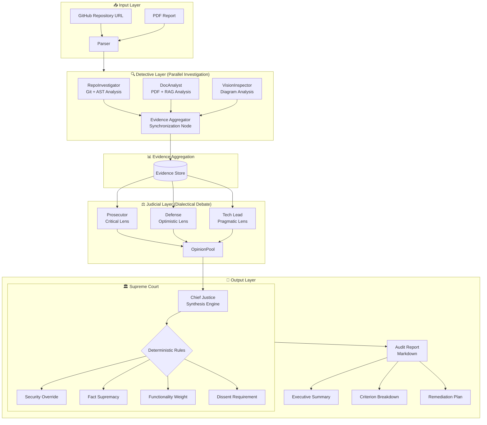
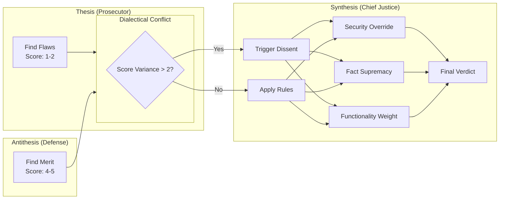

# 🤖 Automaton Auditor
A multi-agent LangGraph swarm for autonomous code audit and governance. Digital courtroom architecture with parallel detectives and dialectical judges.

<div align="center">
  
  
  
  
  
  **A Multi-Agent System for Autonomous Code Audit & Governance**
  
  *"Digital Courtroom Architecture with Parallel Detectives and Dialectical Judges"*
  
</div>

---

## 📋 Overview

The Automaton Auditor is a production-grade **multi-agent system** built with LangGraph that autonomously audits GitHub repositories against complex rubrics. It implements a hierarchical "digital courtroom" architecture where specialized agents collaborate to produce forensic-grade audit reports.

This system addresses the scaling challenge in AI-Native Enterprises: **when 1000 agents generate code simultaneously, humans cannot manually review every PR**. The Automaton Auditor provides automated quality assurance at scale.

---
## 🏛️ Architecture: The Digital Courtroom



### 🔄 Parallel Execution Flow

The architecture implements **two layers of parallel processing**:

| Layer | Components | Pattern |
|-------|------------|---------|
| **Detective Layer** | RepoInvestigator, DocAnalyst, VisionInspector | Fan-out → Aggregate |
| **Judicial Layer** | Prosecutor, Defense, TechLead | Fan-out → Synthesize |

### ⚖️ Dialectical Synthesis 



---

## 🎯 Key Features

### 🔍 Forensic Detective Layer
- **RepoInvestigator**: AST-based code analysis (not regex) with git history forensics
- **DocAnalyst**: PDF parsing with RAG-lite architecture for targeted queries
- **VisionInspector**: Multimodal diagram analysis (optional but implemented)

### ⚖️ Dialectical Judicial Layer
- **Prosecutor**: Adversarial lens - finds flaws, gaps, and security issues
- **Defense**: Optimistic lens - rewards effort and creative solutions  
- **Tech Lead**: Pragmatic lens - evaluates maintainability and viability

### 🏛️ Supreme Court Synthesis
- **Deterministic conflict resolution** (not LLM averaging)
- **Security override rules** - vulnerabilities cap scores
- **Fact supremacy** - evidence overrides opinion
- **Dissent requirement** - explains score variance

### 🛡️ Production-Grade Infrastructure
- **Pydantic validation** throughout
- **State reducers** (`operator.add`, `operator.ior`) for parallel safety
- **Sandboxed execution** with tempfile isolation
- **LangSmith observability** for full traceability
- **uv package management** for dependency isolation

---
# 📂 Project Structure
```bash
automaton-auditor/
├── src/
│   ├── __init__.py
│   ├── state.py                 # Pydantic models with reducers
│   ├── graph.py                  # LangGraph state machine
│   ├── nodes/
│   │   ├── detectives.py         # Forensic collectors
│   │   ├── judges.py              # Three judicial personas
│   │   └── justice.py             # Chief Justice synthesis
│   └── tools/
│       ├── repo_tools.py          # Git + AST analysis
│       └── doc_tools.py           # PDF parsing + RAG
├── tests/
│   ├── test_detectives.py
│   ├── test_judges.py
│   └── test_synthesis.py
├── audits/
│   ├── report_onself_generated/   #  my agent vs my repo
│   ├── report_onpeer_generated/    # my agent vs peer repo
│   └── report_bypeer_received/     # Peer agent vs my repo
├── .env.example                    # API key template
├── pyproject.toml                  # uv dependencies
├── README.md                       # This file
└── Dockerfile                      # Optional container
```
## 🚀 Quick Start

### Prerequisites
```bash
# Install uv (fast Python package manager)
curl -LsSf https://astral.sh/uv/install.sh | sh

# Python 3.10+
python --version
```
# Installation
```bash
# Clone repository
git clone https://github.com/TsegayIS122123/automaton-auditor.git
cd automaton-auditor

# Create virtual environment and install dependencies
uv venv
source .venv/bin/activate  # On Windows: .venv\Scripts\activate
uv pip install -e .

# Set up environment variables
cp .env.example .env
# Edit .env with your API keys
```